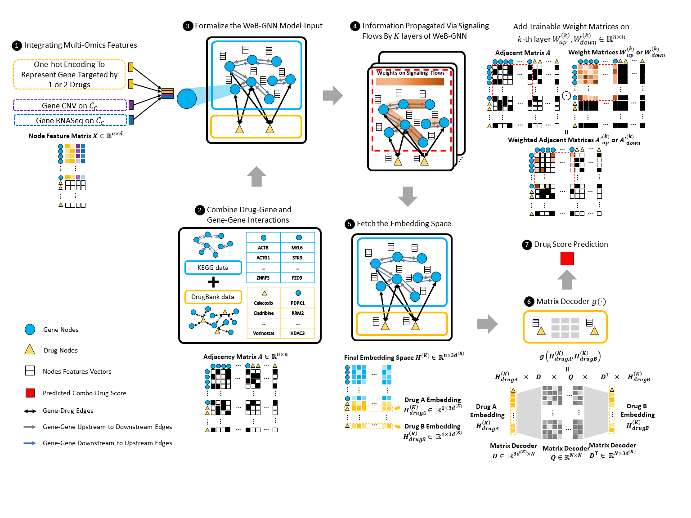
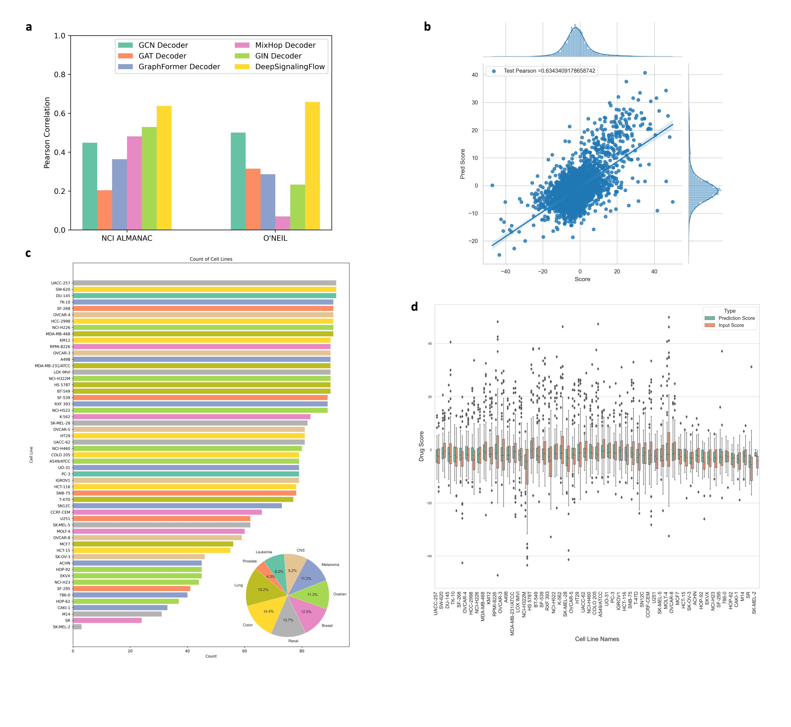
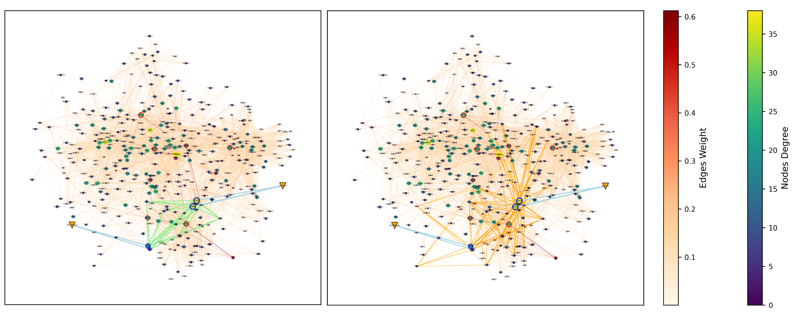
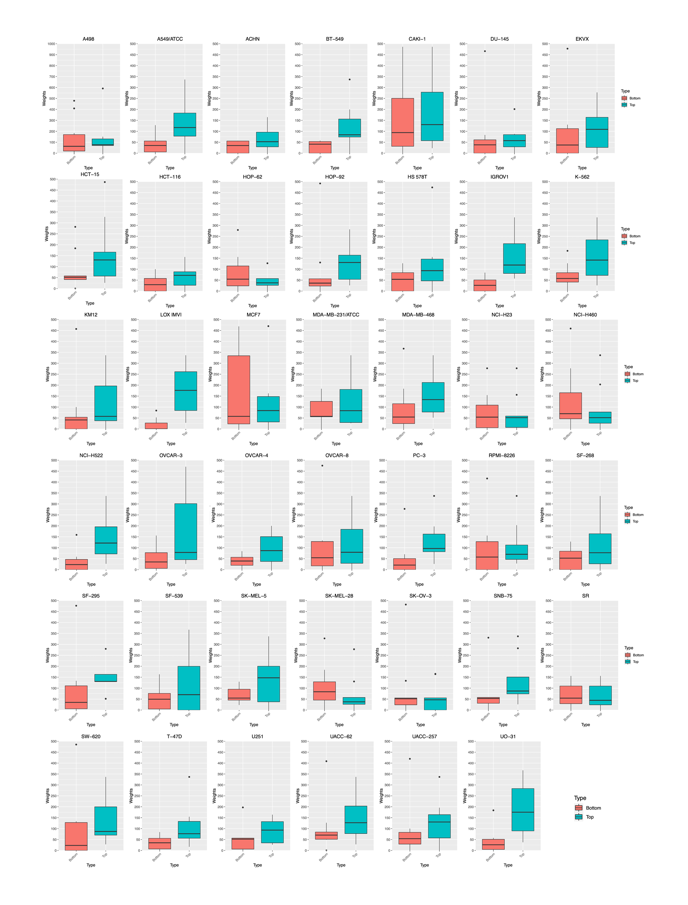
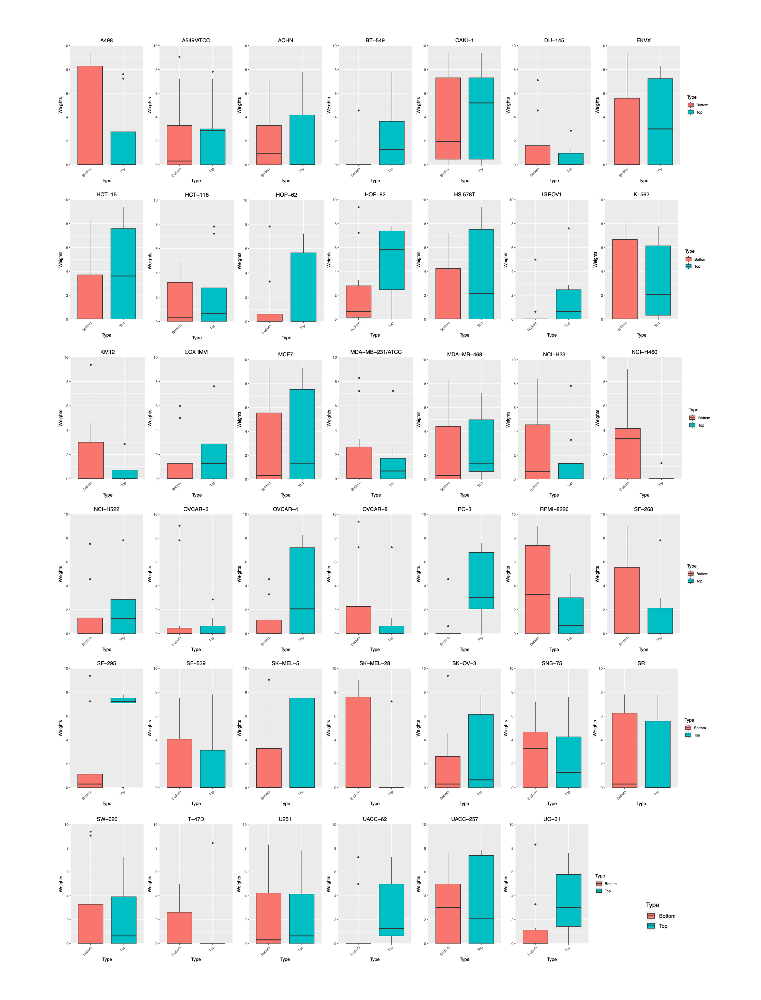

# DeepSignalingFlow: an integrative and interpretable graph AI framework to uncover mechanisms of synergy (MoS) in drug combinations by mining multi-omic data

<p align="center">
  <a href="https://www.nature.com/articles/s41540-024-00421-w">
    
  </a>
  <a href="https://github.com/FuhaiLiAiLab/DeepSignalingFlow">
    
  </a>
  <a href="#license">
    
  </a>
</p>

---

Complex signaling pathways are often implicated in drug resistance. Combining drugs to perturb multiple signaling targets can mitigate resistance, but understanding **mechanisms of synergy (MoS)** remains challenging. Large-scale multi-omic resources and experimentally measured drug-combination synergy scores (e.g., **NCI ALMANAC**, **O’Neil**, **DrugComb**, **DrugCombDB**) create new opportunities to study MoS systematically. **DeepSignalingFlow** models the **directed signaling flow** from disease-critical proteins (with multi-omic evidence) to candidate drug targets—an approach not used by prior methods. Across four synergy datasets, DeepSignalingFlow achieves **state-of-the-art prediction** and interprets MoS via **core signaling flows**, paving the way for precision combination therapy.

---

## Contents

- [1. Model Architecture](#1-model-architecture)
- [2. Run DeepSignalingFlow](#2-run-deepsignalingflow)
  - [2.1 Parse the datasets](#21-parse-the-datasets)
  - [2.2 Train baselines](#22-train-baselines)
  - [2.3 Train DeepSignalingFlow](#23-train-deepsignalingflow)
- [3. Results](#3-results)
- [4. Cell-line Specific Biomarkers](#4-cell-line-specific-biomarkers)
- [5. Result Validation](#5-result-validation)
- [Links](#links)
- [Citation](#citation)
- [License](#license)

---

## 1. Model Architecture



---

## 2. Run DeepSignalingFlow

### 2.1 Parse the datasets

```bash
python load_data.py
```

### 2.2 Train baselines

```bash
python geo_tmain_gat.py
python geo_tmain_gcn.py
python geo_tmain_gformer.py
python geo_tmain_gin.py
python geo_tmain_mixhop.py
```

### 2.3 Train DeepSignalingFlow

```bash
python geo_tmain_webgnn.py
```

---

## 3. Results

<p align="center">
  
</p>

---

## 4. Cell-line–Specific Biomarkers

<p align="center">
  
</p>
<p align="center">
  
</p>

---

## 5. Result Validation

- **Shortest-path weight sums (< 4 hops)** between two drug-target genes (Top-10 vs Bottom-10 combinations, **NCI ALMANAC**):
  <p align="center">
    
  </p>

- **Shortest-path weight sums (< 5 hops)** between two drug-target genes (Top-10 vs Bottom-10 combinations, **NCI ALMANAC**):
  <p align="center">
    
  </p>


---

## Citation

If you use **DeepSignalingFlow** in your research, please cite:

```bibtex
@article{zhang2024using,
  title={Using DeepSignalingFlow to mine signaling flows interpreting mechanism of synergy of cocktails},
  author={Zhang, Heming and Chen, Yixin and Payne, Philip and Li, Fuhai},
  journal={npj Systems Biology and Applications},
  volume={10},
  number={1},
  pages={92},
  year={2024},
  publisher={Nature Publishing Group UK London}
}
```

---

## License

MIT License. See `LICENSE` for details.
