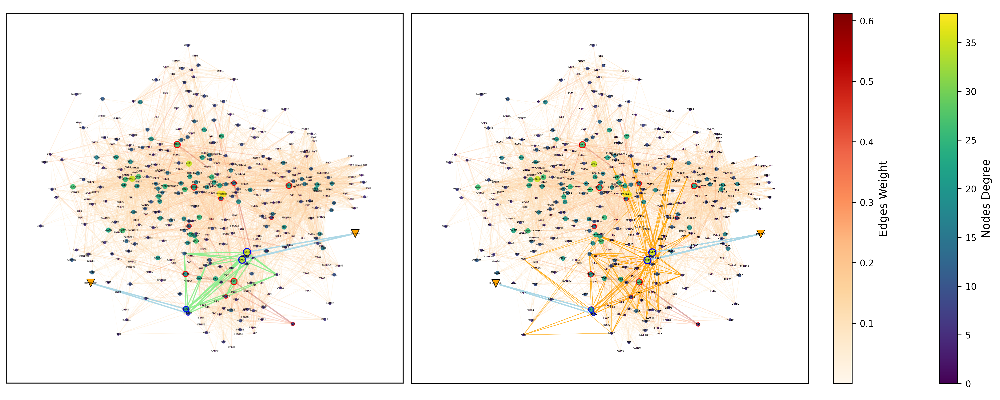

# DeepSignalingFlow

## 1. Model Overall Architecture


## 2. Run the DeepSignalingFlow
### 2.1 Parse the Datasets
```
python load_data.py
```

### 2.2 Run the GNN models for comparisons
```
python geo_tmain_gat.py
python geo_tmain_gcn.py
python geo_tmain_gformer.py
python geo_tmain_gin.py
python geo_tmain_mixhop.py
```
* Following one is DeepSignalingFlow
```
python geo_tmain_webgnn.py 
```

## 3. Model Results


## 4. Cell-line Specific Biomarkers


